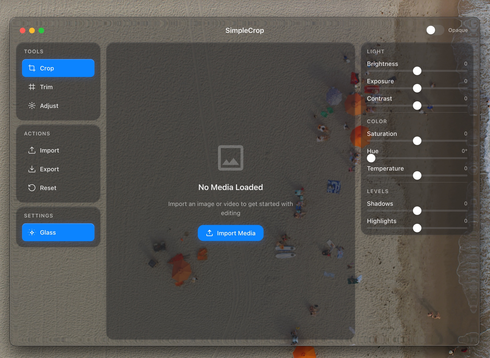

# SimpleCrop 💎

SimpleCrop is a minimalist, premium macOS media editor built with the futuristic **MacOS26 "Liquid Glass"** design language. It provides an intuitive, high-performance experience for cropping, trimming, and adjusting your images and videos with a native macOS feel.



## Features

### 🧊 Liquid Glass Design
- **Native macOS Visuals**: Built with the `electron-liquid-glass` library for authentic translucency, vibrancy, and frosted effects.
- **Dynamic Variants**: Choose from 20 different native glass variants for your workspace.
- **Persistent Settings**: Your glass opacity, border definition, and variants are saved automatically across sessions.

### 🖼️ Media Editing
- **Smart Cropping**: Pixel-perfect cropping for both images and videos.
- **Aspect Ratio Presets**: Support for 1:1, 4:3, 16:9, 9:16, 3:2, and Freeform cropping.
- **Video Trimming**: Intuitive timeline-based trimming to keep exactly what you need.
- **Color Adjustments**: Real-time filters for brightness, contrast, saturation, and hue.

### 🚀 Production Ready
- **High-Fidelity Export**: Built-in FFmpeg integration for high-quality video exports (MP4, MOV, WebM).
- **Portable**: Ready for distribution as a macOS `.dmg` or `.app`.

## Getting Started

### Prerequisites
- macOS (Optimized for macOS 15+)
- [Node.js](https://nodejs.org/) (v18 or higher)
- [FFmpeg](https://ffmpeg.org/) (Handled via internal installers)

### Installation
1. Clone the repository:
   ```bash
   git clone https://github.com/yourusername/SimpleCrop.git
   ```
2. Install dependencies:
   ```bash
   npm install
   ```

### Running the App
```bash
npm start
```

### Building for Production
To package the app into a distribution-ready `.dmg`:
```bash
npm run build
```

## Authors & Credits
Created with ❤️ by **Judelawrosa**.
- **Version**: 1.0.0 (SimpleCrop V1)
- **Contact**: [jvictordr@gmail.com](mailto:jvictordr@gmail.com)

---
*SimpleCrop - Making media editing feel like a native part of your macOS journey.*
